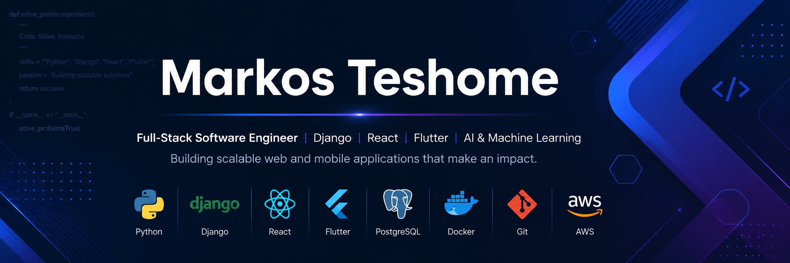

  

<h1 align="center">Hi 👋, I'm Markos Teshome</h1>

<h3 align="center">
Full-Stack Software Engineer | Django & React Developer | Flutter Developer | AI & Machine Learning Enthusiast
</h3>

Building scalable web applications, mobile apps, and intelligent software solutions.

---

## 👨‍💻 About Me

🎓 B.Sc. in Software Engineering

💼 Full-Stack Software Engineer

📱 Flutter Mobile Application Developer

🌐 Django & React Developer

🤖 Passionate about Artificial Intelligence & Machine Learning

🚀 Interested in Backend Engineering, Cloud Computing, and System Design

🌱 Currently learning **Next.js, Docker, Kubernetes, AWS, and CI/CD**

📍 Bahir Dar, Ethiopia

---

## 🛠 Tech Stack

### Languages

- Python
- JavaScript
- TypeScript
- Dart
- HTML5
- CSS3
- SQL

### Frontend

- React
- Next.js
- Tailwind CSS
- Bootstrap
- Material UI

### Backend

- Django
- Django REST Framework
- REST APIs
- JWT Authentication

### Mobile

- Flutter

### Database

- PostgreSQL
- SQLite
- MySQL

### Tools

- Git
- GitHub
- Docker
- Postman
- VS Code
- Figma

---

## 🚀 Featured Projects

### 🚦 Road Traffic Control System

A complete traffic management platform developed for the Amhara Regional Traffic Authority.

**Features**

- Driver & Vehicle Verification
- Citation Management
- Digital Payment Integration
- Admin Dashboard
- Mobile Application
- REST API

**Tech Stack**

Django • DRF • React • Flutter • PostgreSQL

---

### 📝 Django Blog API

A RESTful blogging platform with authentication, CRUD operations, and modern API architecture.

---

### 📒 React Django Notes App

A Full-Stack Notes Application built using React, Django REST Framework, and PostgreSQL.

---

### 🎓 Ethiopics Global University

An online education platform connecting Ethiopian tutors with language learners worldwide.

---

## 💼 Professional Experience

**Software Engineer**

Doctor Nega Education Center

- Developed educational software solutions
- Built responsive web applications
- Collaborated with development teams
- Maintained backend APIs

---

## 📚 Currently Learning

- Advanced Django
- Next.js
- Docker
- Kubernetes
- AWS Cloud
- System Design
- Microservices

---

## 🎯 2026 Goals

- Build scalable SaaS applications
- Contribute to Open Source
- Earn AWS Cloud Certification
- Master DevOps Practices
- Publish high-quality software projects

---

## 🤝 Let's Connect

🌐 Portfolio

https://markos-portfolioo.netlify.app

💼 LinkedIn

https://www.linkedin.com/in/markos-teshome-40b061336

🐦 X (Twitter)

https://x.com/MarkosTesh25364

📷 Instagram

https://www.instagram.com/zeanbesa7066

📧 Email

zeanbesa7066@gmail.com

---

⭐ *"Code with purpose. Build solutions that create impact."*
